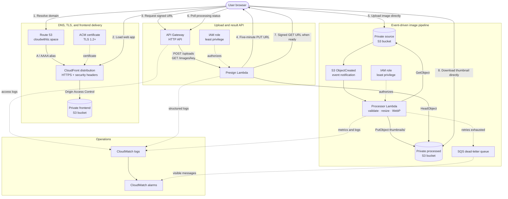

# Serverless Image Processing Application

A portfolio project demonstrating an event-driven AWS image pipeline. A browser requests a short-lived upload URL, uploads an image directly to private object storage, and an S3 event invokes Lambda to create an optimized thumbnail in a separate bucket.

## What this demonstrates

| Cloud engineering skill | Implementation |
|---|---|
| Event-driven architecture | S3 `ObjectCreated` events asynchronously invoke the processor |
| Object storage | Separate private source, processed, and frontend S3 buckets |
| Lambda automation | Python functions issue presigned URLs and resize images with Pillow |
| Permissions | Separate least-privilege execution roles; no public S3 access |
| API design | API Gateway HTTP API with validation and CORS |
| Reliability | Idempotent destination keys, retry/DLQ configuration, structured logs, alarms |
| Infrastructure as code | Reproducible Terraform resources and outputs |
| Delivery | CloudFront-hosted UI, Route 53 DNS, ACM TLS, tests, and CI validation |

## Architecture



Using two buckets is deliberate: it prevents processed objects from retriggering the same function. Upload and download URLs expire, while both buckets stay private.

## Repository layout

```text
frontend/               CloudFront-hosted browser client
src/presign/            Upload/download URL Lambda
src/processor/          S3-triggered image processor
terraform/              AWS infrastructure and IAM
bootstrap/              State bucket and GitHub Actions OIDC roles
tests/                  Unit tests
docs/                   Design and operations notes
scripts/                 Reproducible Lambda packaging
```

## Run tests locally

Python 3.12 is expected.

```bash
python -m venv .venv
source .venv/bin/activate
pip install -r requirements-dev.txt
pytest
```

## Deploy

Prerequisites: AWS credentials, Terraform >= 1.10, Docker, and an AWS account. Docker creates a Linux-compatible Pillow package even when deployment is run from macOS.

```bash
./scripts/package-lambdas.sh
terraform -chdir=terraform init
terraform -chdir=terraform plan -out=tfplan
terraform -chdir=terraform apply tfplan
```

Terraform provisions the frontend bucket and delivery infrastructure. The frontend deployment script generates its API configuration, uploads the site, and invalidates CloudFront. ACM is validated through Route 53, and both `cloudwithliz.space` and `www.cloudwithliz.space` map to CloudFront. Retrieve the public address with:

```bash
terraform -chdir=terraform output -raw application_url
```

Open `https://cloudwithliz.space` in a browser. Certificate validation and CloudFront's first global deployment can take several minutes. The local `http://localhost:8080` origin remains allowed for optional frontend development.

Destroy sandbox resources when finished:

```bash
terraform -chdir=terraform destroy
```

See [docs/deployment.md](docs/deployment.md) for the GitHub Actions and OIDC deployment guide, [docs/architecture.md](docs/architecture.md) for design decisions, and [docs/runbook.md](docs/runbook.md) for operations and troubleshooting.

## Security notes

- S3 public access is blocked and all objects use server-side encryption.
- The frontend bucket is readable only through CloudFront Origin Access Control.
- Route 53 points the apex and `www` records to CloudFront using IPv4 and IPv6 aliases.
- ACM provides an automatically renewed TLS certificate; CloudFront enforces TLS 1.2 or newer.
- The browser can upload only through a five-minute presigned URL for a generated key.
- Content type, filename, and upload size are validated before signing and again by the processor.
- Each Lambda has its own role and access only to the bucket operations it needs.
- API throttling, log retention, SQS redrive, and CloudWatch alarms provide basic guardrails.

This is a learning/portfolio workload. Before production use, add authentication (Cognito or an external IdP), malware scanning, WAF, and a durable job-status store.
