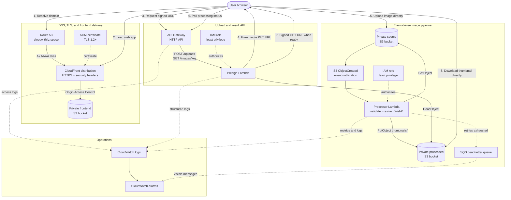

# Architecture decisions

## System architecture

## Why presigned URLs?

API Gateway and Lambda never proxy image bytes. The API authorizes the operation and returns a five-minute S3 URL, so uploads scale with S3 and Lambda cost and payload limits are avoided. The URL fixes the object key and content type.

## Frontend hosting

Terraform provisions a dedicated private S3 bucket and exposes it through CloudFront over HTTPS. Origin Access Control allows only that distribution to read frontend objects. The frontend delivery workflow generates `config.js` from Terraform's deployed API output, uploads the static client, and invalidates CloudFront. This gives infrastructure and frontend content separate owners without manual wiring. CloudFront also adds baseline browser security headers and redirects HTTP requests to HTTPS.

Route 53 maps `cloudwithliz.space` and `www.cloudwithliz.space` to the distribution with alias records for IPv4 and IPv6. ACM issues and renews the certificate from `us-east-1`, as required by CloudFront, using Terraform-managed DNS validation records in the existing public hosted zone.

## Why asynchronous processing?

An `ObjectCreated` notification decouples ingestion from transformation. Users get a completed upload immediately; Lambda can scale independently. S3 invokes at least once, so the destination key is deterministic and repeated events safely overwrite the same thumbnail.

## Failure model

Lambda retries asynchronous failures twice. Exhausted events go to an encrypted SQS dead-letter queue and an alarm detects visible messages. The processor rejects oversized or invalid objects and emits JSON logs. The current UI polls because the typical operation is short; a larger system could store state in DynamoDB and notify via WebSocket or EventBridge.

## Security boundaries

The presign function can put source objects and read processed objects. The processor can read only source objects and write only the `thumbnails/` prefix. Bucket policies block public access and S3 encrypts at rest. API Gateway applies throttling. Authentication is intentionally called out as the next production control rather than implied by the demo.

## Cost and scaling

The design is pay-per-request. Processor reserved concurrency limits burst cost to five simultaneous executions. Original images expire after 30 days and results after 90 days. For sustained traffic, tune memory with Lambda Power Tuning, introduce SQS between S3 and Lambda for explicit back-pressure, and use CloudFront for result delivery.
